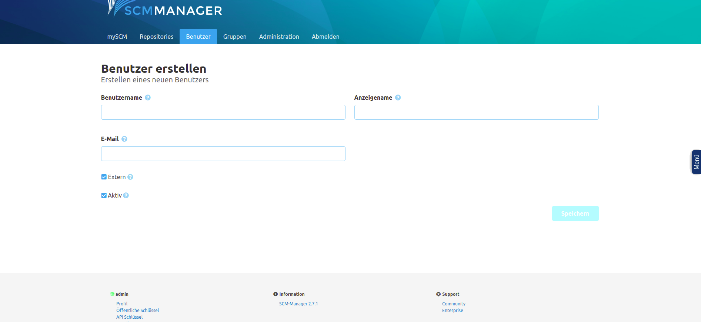
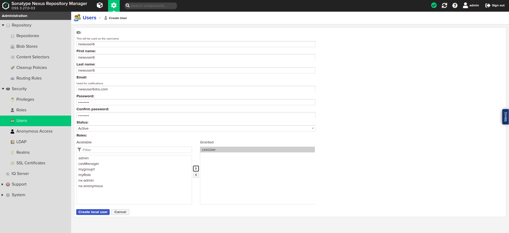
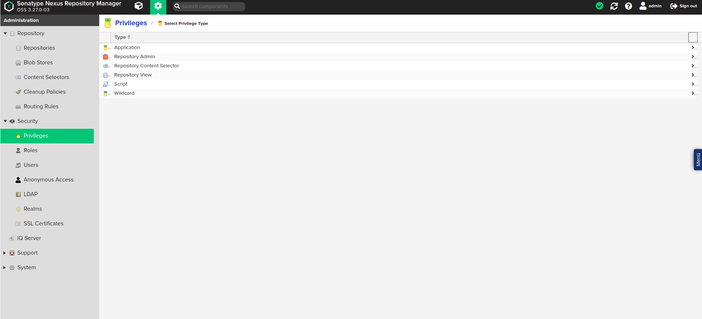

# Administrationshinweise

## Berechtigungen neuer Nutzer im User Management
### Gruppen
Ein neu angelegter Benutzer hat keine ihm zugewiesenen Gruppen. Grundsätzlich sind immer zwei Gruppen verfügbar, 
welche einem Nutzer zugewiesen werden können. Die "cesManager"-Gruppe und die "cesAdmin"-Gruppe. Desweiteren 
können im User Management unter dem Reiter "Gruppen" weitere Gruppen hinzugefügt und den Benutzern zugewiesen 
werden. Diese Gruppen werden auf die einzelnen Dogus übertragen und können dort berechtigt werden.

#### cesManager Gruppe
Ein Nutzer in der cesManager Gruppe hat Zugriff auf die Administrativen Dogus, wie zum Beispiel das Backup & Restore Dogu.

#### cesAdmin Gruppe
Der Name dieser Gruppe wird beim CES-Setup ausgewählt und kann daher variieren. In den folgenden Abschnitten wird zur 
Vereinfachung davon ausgegangen, dass diese Gruppe immer "cesAdmin" heißt. Nutzer in dieser Gruppe bekommen alle 
administrativen Berechtigungen in sämtlichen Dogus.

## Häufig auftretende Probleme
### Manuell angelegte Nutzer und Gruppen
In einigen Dogus führt es zu Problemen, wenn ein Nutzer im Dogu angelegt wird. Grundsätzlich muss ein Nutzer im User Management angelegt werden, damit dieser sich in allen Dogus anmelden kann.
Einige Dogus unterstützen zusätzlich das manuelle Anlegen von Nutzern, in anderen kann es aber zu Problemen führen.

Sollte es in einem Dogu nicht möglich sein, dass sich ein bestimmter Nutzer, welcher im User Management bereits angelegt wurde, im Dogu anmelden kann, kann die Ursache dafür sein, dass der Nutzer manuell im Dogu angelegt wurde. 

Sollte das der Fall sein, muss der Nutzer in diesem Dogu gelöscht werden. Der Nutzer wird dann automatisch mit dem Dogu synchronisiert, sobald er sich das erste Mal einloggt.

Dasselbe gilt für Gruppen, die manuell angelegt wurden. Sollte es dabei zu Problemen führen, müssen diese im Dogu ebenfalls gelöscht werden.

### Änderung von Benutzerdaten

Sollten sich die Daten eines Nutzers verändern, wie z.B der Name, so müssen diese Änderungen im User Management erfolgen. Änderungen in den einzelnen Dogus sind unwirksam, da diese beim nächsten Login des Nutzers wieder mit denen aus dem User Management überschrieben werden.
Die Synchronisierung von Benutzerdaten findet zum Zeitpunkt des Logins in einem Dogu statt. Wird also zum Beispiel der Name eines Nutzers im User Management verändert, wird dies erst dann in einem Dogu sichtbar, wenn der Nutzer sich dort nach der Änderung eingeloggt hat.

## Besonderheiten SCM-Manager Dogu
Im SCM-Manager existieren Nutzer und Gruppen. Die Gruppen im SCM-Manager entsprechen dabei den Gruppen eines Nutzers im User Management.
Sobald sich ein Nutzer im SCM-Manager anmeldet, wird der Nutzer ebenfalls im SCM-Manager angelegt.

### Standardzustand
Ein normaler Benutzer kann weder eigene Repositories erstellen, noch vorhandene Repositories sehen. Allerdings kann ein Administrator oder der Ersteller eines Repositories, einen Nutzer oder eine Gruppe berechtigen, ein Repository zu sehen bzw. zu bearbeiten.

Mitglieder der Gruppe "cesAdmin" sind automatisch Administratoren des SCM-Managers. Sie können alle Repositories sehen und bearbeiten, sowie alle Funktionen des SCM-Managers vollumfänglich nutzen.

### Berechtigung und Synchronisierung
Nutzer, welche sich zuvor noch nie im SCM-Manager eingeloggt haben, sind im SCM-Manager nicht vorhanden. 

Da die Nutzer erst bei ihrem Login angelegt werden, können diese nicht ohne weiteres vorher berechtigt werden.
Ist aber der Name eines Nutzers aber bekannt, so kann ein Nutzer mit diesem Namen angelegt werden. Dieser muss als externer Nutzer markiert werden. Anschließend kann dieser berechtigt werden. Dasselbe gilt für Gruppen.

Sollte sich ein Nutzer, welcher aktuell noch nicht im SCM-Manager existiert, über CAS einloggen, so wird dieser im SCM-Manager angelegt.
Das gilt allerdings nicht für Gruppen. Wenn Gruppen berechtigt werden sollen, so müssen diese als externe Gruppen manuell angelegt und berechtigt werden.  

Werden die Daten eines Nutzers verändert und der Nutzer loggt sich erneut ein, so werden die veränderten Daten mit denen aus dem User Management überschrieben.
Sollen die Daten eines Nutzers verändert werden, so muss dies über das User Management geschehen.

## Besonderheiten im Nexus Dogu
Im Nexus Dogu existieren Nutzer und Rollen. Die Rollen entsprechen dabei den Gruppen eines Nutzers im User Management.
Dazu gibt es die sogenannten Privilegien, die bestimmen, welche tatsächlichen Berechtigungen ein Benutzer im Nexus-Dogu hat.

### Standardzustand
Grundsätzlich im Nexus angelegt wird die Gruppe "cesUser". Diese Gruppe wird jedem Benutzer zugewiesen und enthält 
immer die folgenden Privilegien:

* nx-apikey-all (Der Benutzer hat sämtliche Berechtigungen für den Umgang mit dem API-Key)

* nx-healthcheck-read (Der Benutzer hat die Berechtigung, den Healthcheck zu lesen)

* nx-healthcheck-summary-read (Der Benutzer hat die Berechtigung, die Healthcheck-Summary zu lesen)

* nx-repository-view-*-*-add

* nx-repository-view-*-*-browse (Der Benutzer kann die Liste aus vorhandenen Repositories sehen)

* nx-repository-view-*-*-read (Der Benutzer kann den Inhalt vorhandener Repositories sehen)

* nx-search-read (Der Benutzer hat die Möglichkeit, die Suchfunktion zu benutzen)

* nx-userschangepw (Der Benutzer kann sein Passwort ändern)  
  
Die Gruppe "cesAdmin" wird ebenfalls grundsätzlich angelegt und erhält das Privileg "nx-all". Das bedeutet, dass Mitglieder dieser Gruppe im Nexus sämtliche möglichen Aktionen durchführen können.

### Berechtigung und Synchronisierung
Ein Nutzer und seine Gruppen (Rollen) werden bei dessen Login Synchronisiert. Falls diese im Nexus nicht existieren, 
werden sie angelegt. Falls sie sich verändert haben, werden sie im Nexus verändert. 
Diese Synchronisierung fuktioniert nur vom User Management zum Nexus Dogu. Werden die Daten, wie zum Beispiel Name oder 
E-Mail eines Nutzers, im Nexus geändert, so werden diese bei seinem nächsten Login wieder überschrieben.
Um die Daten eines Nutzers zu verändern, müssen diese im User Management angepasst werden.

Vor dem ersten Login eines Nutzers ist es nicht bzw. nicht ohne weiteres möglich, diesem Berechtigungen zu geben, da 
im Nexus der Nutzer erst dann angelegt wird, wenn er sich zum ersten Mal einloggt. 
Ist aber der genaue Benutzername des Nutzers bereits bekannt, so kann dieser manuell im Nexus angelegt und berechtigt werden.
Dasselbe gilt für Gruppen (Rollen).

Die Besonderheit bei der Synchronisierung von Gruppen ist die, dass das Zuweisen von Gruppen im User Management zwar
dazu führt, dass der Nutzer im Nexus auch die entsprechende Rolle bekommt, das Entfernen von Gruppen im User Management
jedoch nicht dazu führt, dass dem Nutzer diese Gruppe im Nexus wieder entzogen wird. Dieser Schritt muss manuell erfolgen.
Die einzige Ausnahme von dieser Regel ist die "cesAdmin"-Gruppe. Diese wird den Nutzern entzogen, sobald diese im
User Management entfernt wurde.

### Weitere Informationen
Die Offizielle Dokumentation kann hier gefunden werden:
* Privilegien: https://help.sonatype.com/repomanager3/system-configuration/access-control/privileges
* Rollen: https://help.sonatype.com/repomanager3/system-configuration/access-control/roles
* Benutzer: https://help.sonatype.com/repomanager3/system-configuration/access-control/users

## Beispiel: Rechtevergabe SCM-Manager Dogu
Für dieses Beispiel wurde im Vorraus der Benutzer "newuser6" mit der Gruppe "user6role" im User Management angelegt.

### Optional: Legen Sie einen neuen Nutzer an
Dieser Schritt kann übersprungen werden, wenn der zu berechtigende Nutzer sich bereits eingeloggt hat.

Klicken Sie auf den Reiter "Benutzer" und klicken Sie anschließend auf "Benutzer erstellen".

In das Formular geben Sie nun den Namen des Nutzers ein und aktivieren Sie die Checkbox "Extern".
Wichtig: Der Benutzername des Nutzers muss exakt dem Benutzernamen des Nutzers im User Management entsprechen.

Klicken Sie dann auf "Speichern", um den Nutzer anzulegen.

Der Nutzer kann nun berechtigt werden.

### Legen Sie die zu berechtigende Gruppe an
Da die Gruppen aus dem User Management im SCM-Manager nicht im Dogu angelegt werden, muss dieser Schritt zwangsläufig erfolgen, sofern eine Gruppe berechtigt werden soll.

Klicken Sie dafür auf den Reiter "Gruppen" und anschließend auf "Gruppe erstellen".

In das Formular geben Sie nun den Namen der Gruppe sowie eine Beschreibung ein und aktivieren Sie die Checkbox "Extern".
Wichtig: Der Name der Gruppe muss exakt dem Namen der Gruppe im User Management entsprechen.

Klicken Sie dann auf "Speichern", um die Gruppe anzulegen.

Die Gruppe kann nun berechtigt werden.

### Generelle Berechtigung eines Nutzers im SCM-manager
Klicken Sie auf den Reiter "Benutzer" und wählen Sie in der Liste der Benutzer den Benutzer aus, den Sie berechtigen wollen.

Anschließend klicken Sie auf "Einstellungen", dann auf "Berechtigungen".

Wählen Sie dort die Berechtigungen aus, die der Nutzer erhalten soll und klicken Sie auf "Berechtigungen speichern". 

### Generelle Berechtigung einer Gruppe im SCM-manager
Klicken Sie auf den Reiter "Gruppen" und wählen Sie in der Liste der Gruppen die Gruppe aus, die Sie berechtigen wollen.

Anschließend klicken Sie auf "Einstellungen", dann auf "Berechtigungen". Wählen Sie dort die Berechtigungen aus, die die Gruppe erhalten soll und klicken Sie auf "Berechtigungen speichern". 

Die Berechtigungen sind nun für den Nutzer wirksam.

### Berechtigung eines Nutzers oder einer Gruppe für ein bestimmtes Repository

Rufen Sie die Seite Ihres Repositories auf, klicken Sie dort auf "Einstellungen" und anschließend auf "Berechtigungen".

Unter der Überschrift "Neue Berechtigung hinzufügen" wählen Sie entweder "Benutzerberechtigung" oder "Gruppenberechtigung" aus,
je nachdem ob die neue Berechtigung für nur einen Nutzer oder für eine Gruppe erstellt werden soll.
In das Feld "Benutzer" bzw. "Gruppe" schreiben Sie nun den Namen des zu berechtigenden Benutzers oder der Gruppe.

Nun haben Sie die Möglichkeit, dem eine eine vorgefertigte Rolle zuzuweisen, bei dem dieser ein vordefiniertes Set an Berechtigungen bekommt.
Wählen Sie dafür einen Eintrag aus der Liste "Rolle" aus.

Alternativ können Sie jede Berechtigung selbst bestimmen. Klicken Sie dafür auf die Schaltfläche "Erweitert". Es öffnet sich ein Dialog. 
Dort wählen Sie die Berechtigungen aus, welche der Nutzer erhalten soll und klicken auf "Speichern".

Haben Sie alle gewünschten Berechtigungen hinzugefügt, klicken Sie auf "Speichern".
Der Nutzer bzw. die Gruppe hat nun die von Ihnen gewählten Berechtigungen für das von Ihnen gewählte Repository.

Die neuen Berechtigungen sind nun wirksam.

## Beispiel: Rechtevergabe Nexus Dogu
Für dieses Beispiel wurde im Vorraus der Benutzer "newuser6" mit der Gruppe "user6role" im User Management angelegt.

### Optional: Legen Sie eine neue Rolle an
Dieser Schritt kann übersprungen werden, sofern sich der zu berechtigende Nutzer bereits eingeloggt hat.

Klicken Sie auf das Zahnrad, um in den Administratoren-Bereich zu gelangen. Dort klicken sie auf "Roles", "Create role" und
anschließend auf "Nexus role".

In dem nun sichtbaren Formular geben Sie eine "Role ID" und einen "Role name" ein. Dabei ist es wichtig, dass der Wert im 
Feld "Role ID" exakt dem Namen der zu berechtigenden Gruppe im User Management entspricht.
Drücken Sie anschließend auf "Create role". 

Die Rolle ist nun erstellt und kann einem Nutzer zugewiesen werden.

### Optional: Legen Sie einen Nutzer an
Dieser Schritt kann übersprungen werden, sofern sich der zu berechtigende Nutzer bereits eingeloggt hat.

Klicken Sie auf das Zahnrad, um in den Administratoren-Bereich zu gelangen. Dort klicken sie auf "Users" 
und anschließend auf "Create local User".

In dem nun sichtbaren Formular geben Sie die Daten des Benutzers ein. Dabei ist es wichtig, dass der Wert im Feld "ID" exakt
dem Benutzernamen des zu berechtigenden Benutzers entspricht. 

Geben Sie dem Benutzer die von Ihnen erstellte Rolle. Die anderen Werte werden bei dem Login des Benutzers mit den Werten aus dem User Management überschrieben. Klicken Sie nun auf "Create local User". 

Der Nutzer ist nun erstellt und kann berechtigt werden.

### Berechtigen einer Rolle im Nexus
Wählen Sie in der Rollenübersicht die zu berechtigende Rolle aus. 

Unter der Überschrift "Privileges:" können dieser Rolle nun Privilegien zugewiesen werden. 

Die wichtigsten Privilegien für einen Nutzer sind:
* nx-repository-view-*-*-browse (Nutzer kann vorhandene Repositories sehen)
* nx-repository-view-*-*-read (Nutzer kann den Inhalt vorhandener Repositories sehen)
* nx-repository-view-*-*-edit (Nutzer kann den Inhalt vorhandener Repositories verändern)
* nx-repository-view-*-*-delete (Nutzer kann den Inhalt vorhandener Repositories Löschen)
* nx-repository-admin-*-*-browse (Nutzer kann vorhandene Repositories im Administrationsbereich sehen)
* nx-repository-admin-*-*-add (Nutzer kann neue Repositories im Administrationsbereich hinzufügen)
* nx-repository-admin-*-*-edit (Nutzer kann die Konfiguration vorhandener Repositories im Administrationsbereich verändern)
* nx-repository-admin-*-*-delete (Nutzer kann Repositories im Administrationsbereich Löschen)

Unter der Überschrift "Roles:" können dieser Rolle weitere Rollen hinzugefügt werden. Die Berechtigungen der hinzugefügten
Rollen sind nun auch für diese Rolle verfügbar.

Wollen Sie einer Rolle den Zugriff auf ein bestimmtes Repository geben, gibt es dafür besondere Privilegien.
Sie werden automatisch nach dem Namensschema `nx-repository-<privileg-typ>-<repository-typ>-<repositoryName>-<action>` erstellt, 
sobald ein neues Repository angelegt wird.

#### \<privileg-typ\>
Der Typ eines Privilegs kann entweder "admin" oder "view" sein. 
Ist der Typ "view", bezieht sich die Berechtigung auf den normalen Nutzerbereich.
Ist der Typ "admin", bezieht sich die Berechtigung auf den Administrationsbereich.

#### \<repository-typ\>
Dies ist der Typ des Repositories. Der Typ eines Repositories wird bei dessen Erstellung festgelegt. Dies kann zum Beispiel "docker" oder "raw" sein.

#### \<repositoryName\>
Das ist der Name des erstellten Repositories.

#### \<action\>
Die Aktion kann "delete", "browse", "read", "edit" oder "*" sein.
Die Aktion "delete" bezieht sich auf löschende Aktionen
Die Aktion "browse" bezieht sich auf Aktionen, die z.B. Repository-Listen anzeigen
Die Aktion "read" bezieht sich auf lesende Zugriffe
Die Aktion "edit" bezieht sich auf bearbeitende Zugriffe
Die Aktion "\*" bezieht sich auf alle vorher genannten Aktionen.

#### Beispiele:
Das Privileg "nx-repository-view-raw-testrepo-browse" hat die Wirkung, dass ein Nutzer mit diesem Privileg das Repository "testrepo" in der Liste der vorhandenen Repositories sehen kann.

Das Privileg "nx-repository-admin-raw-testrepo-browse" hat die Wirkung, dass ein Nutzer mit diesem Privileg das Repository "testrepo" in der Liste der vorhandenen Repositories im Administrationsbereich sehen kann.

Das Privileg "nx-repository-view-raw-testrepo-read" hat die Wirkung, dass ein Nutzer mit diesem Privileg Inhalte aus dem Repository "testrepo" lesen kann.

#### Manuelles Erstellen von Privilegien
Alternativ kann auch ein eigenes Privileg erstellt werden, bei welchem bestimmte Aktionen festgelegt werden können.
Klicken Sie dafür im Administrationsbereich auf "Privileges" und anschließend auf "Create privilege".

Dort wählen Sie den Eintrag "Repository View", um Nutzer für den normalen Bereich zu berechtigen oder den Eintrag "Repository Admin",
um einen Nutzer für den Administrationsbereich zu berechtigen.

Ihnen wird nun ein Formular angezeigt. Füllen Sie dieses, wie im Folgenden erklärt, aus und klicken Sie dann auf "Create privilege". 
Anschließend kann das Privileg wie oben beschrieben einer Rolle hinzugefügt werden.

#### Name
Ein frei wählbarer Name für das Privileg. Unter diesem Namen wird die Berechtigung später in der Liste der Privilegien gefunden.

#### Description
Eine frei wählbare Beschreibung für das Privileg.

#### Repository
Dort wählen Sie aus einer Liste Ihr gewünschtes Repository aus.

#### Actions
Die Aktionen, die für das Repository ausführbar sein sollen. Diese können hier kommasepariert eingegeben werden. 

#### Format
Das Format des Repositories, für das das Privileg die Berechtigung erteilen soll. Wenn Sie sich nicht sicher sind, welches Format Ihr Repository besitzt, können Sie dies in der Liste der Repositories nachsehen.

Das Privileg kann nun, wie weiter oben beschrieben, einer Rolle zugewiesen werden.

## Jenkins /  CAS Plugin

Im Bereich *Jenkins verwalten* sind über den Unterpunkt *Plugins verwalten* alle installierten Jenkins-Plugins abrufbar. Diese werden im Reiter *Installiert* angezeigt.

Benutzer mit Administrationsberechtigungen können an dieser Stelle Plugins entsprechend ihrer Abhängigkeiten deinstallieren. Hierbei ist besonders darauf zu achten, dass das **CAS Plugin betriebsnotwendig** ist und damit niemals deinstalliert werden darf. Sollte dieses dennoch entfernt werden, ist ein Start des Jenkins Dogus nicht mehr möglich.

