Translated with www.DeepL.com/Translator

# administration notes

## Authorizations of new users in User Management
### Groups
A newly created user has no groups assigned to him. Basically, there are always two groups available
which can be assigned to a user. The "cesManager" group and the "cesAdmin" group. Furthermore
further groups can be added in the user management under the tab "Groups" and assigned to the users.
be assigned to the users. These groups are transferred to the individual Dogus and can be authorized there.

#### cesManager group
A user in the cesManager group has access to the Administrative Dogus, such as the Backup & Restore Dogu.

#### cesAdmin Group
The name of this group is selected during CES setup and therefore may vary. In the following sections, for simplicity
simplification, it is assumed that this group is always named "cesAdmin". Users in this group get all administrative
administrative permissions in all dogus.

## Common problems
### Manually created users and groups
In some dogus it leads to problems when a user is created in the dogu. Basically, a user must be created in User Management so that it can log in to all dogus.
Some dogus additionally support the manual creation of users, but in others it can lead to problems.

If it is not possible in a dogu for a certain user, which has already been created in User Management, to log in to the dogu, the reason may be that the user was created manually in the dogu.

If this is the case, the user must be deleted in this Dogu. The user will then be automatically synchronized with the Dogu the first time he logs in.

The same applies to groups that were created manually. If there are any problems with this, they must also be deleted in the dogu.

### Change of user data

If a user's data changes, such as their name, these changes must be made in User Management. Changes in the individual dogus are ineffective, as they will be overwritten with those from User Management the next time the user logs in.
The synchronization of user data takes place at the time of login in a dogu. For example, if a user's name is changed in User Management, this will not be visible in a Dogu until the user has logged in there after the change.

## Special features of SCM Manager Dogu
In the SCM-Manager there are users and groups. The groups in the SCM-Manager correspond to the groups of a user in the User Management.
As soon as a user logs in to the SCM Manager, the user is also created in the SCM Manager.

### Default state
A normal user cannot create their own repositories, nor can they see existing repositories. However, an administrator or the creator of a repository can authorize a user or group to view or edit a repository.

Members of the "cesAdmin" group are automatically administrators of the SCM Manager. They can see and edit all repositories and fully use all functions of the SCM Manager.

### Authorization and synchronization
Users who have never logged into the SCM Manager before do not exist in the SCM Manager.

Since users are not created until they log in, they cannot easily be authorized beforehand.
However, if the name of a user is known, a user with this name can be created. This user must be marked as an external user. Afterwards this user can be authorized. The same applies to groups.

If a user who does not currently exist in the SCM Manager logs in via CAS, this user will be created in the SCM Manager.
However, this does not apply to groups. If groups are to be authorized, they must be created and authorized manually as external groups.

If a user's data is changed and the user logs in again, the changed data is overwritten with the data from User Management.
If a user's data is to be changed, this must be done via User Management.

## Special features in Nexus Dogu
In Nexus Dogu there are users and roles. The roles correspond to the groups of a user in User Management.
In addition, there are the so-called privileges, which determine which actual authorizations a user has in Nexus Dogu.

### Default state
Basically, the "cesUser" group is created in Nexus. This group is assigned to each user and always contains
always the following privileges:

* nx-apikey-all (The user has all privileges to handle the API key).

* nx-healthcheck-read (The user has the privilege to read the healthcheck)

* nx-healthcheck-summary-read (The user has permission to read the healthcheck summary)

* nx-repository-view-*-add

* nx-repository-view-*-*-browse (The user can see the list from existing repositories)

* nx-repository-view-*-*-read (The user can see the content of existing repositories)

* nx-search-read (The user has the possibility to use the search function)

* nx-userschangepw (The user can change his password)

The group "cesAdmin" is also basically created and given the privilege "nx-all". This means that members of this group can perform all possible actions in the Nexus.

### Authorization and synchronization
A user and his groups (roles) are synchronized when he logs in. If they do not exist in the Nexus
they are created. If they have changed, they will be changed in the Nexus.
This synchronization works only from User Management to Nexus Dogu. If the data, such as name or
e-mail of a user are changed in the Nexus, they will be overwritten the next time the user logs in.
To change a user's data, it must be adjusted in User Management.

Before a user logs in for the first time, it is not or not easily possible to give him permissions, because
in Nexus the user is only created when he logs in for the first time.
However, if the exact user name of the user is already known, then this user can be created and authorized manually in the Nexus.
The same applies to groups (roles).

The special feature of the synchronization of groups is that the assignment of groups in the user management does not
the user gets the corresponding role in Nexus, but removing groups in User Management does not lead to the user
does not result in the user being deprived of this group in the Nexus. This step must be done manually.
The only exception to this rule is the "cesAdmin" group. This will be removed from the users as soon as it is removed in the
User Management has been removed.

### Further information
Official documentation can be found here:
* Privileges: https://help.sonatype.com/repomanager3/system-configuration/access-control/privileges
* Roles: https://help.sonatype.com/repomanager3/system-configuration/access-control/roles
* User: https://help.sonatype.com/repomanager3/system-configuration/access-control/users

## Example: Assigning rights to SCM Manager Dogu
For this example, the user "newuser6" with the group "user6role" was created in User Management in advance.

### Optional: Create a new user
This step can be skipped if the user to be authorized has already logged in.

Click on the "Users" tab and then click on "Create user".

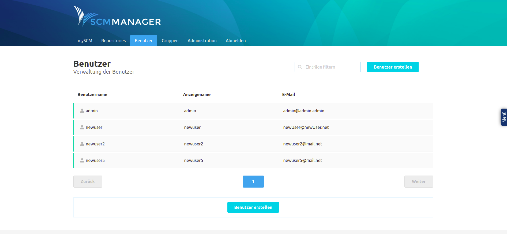

Now enter the name of the user into the form and activate the checkbox "External".
Important: The user name of the user must be exactly the same as the user name of the user in the User Management.

Then click on "Save" to create the user.

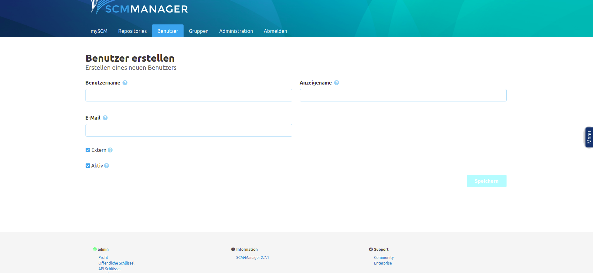

The user can now be authorized.

### Create the group to be authorized
Since the groups from the User Management in the SCM Manager are not created in the Dogu, this step must necessarily take place if a group is to be authorized.

To do this, click on the "Groups" tab and then on "Create group".

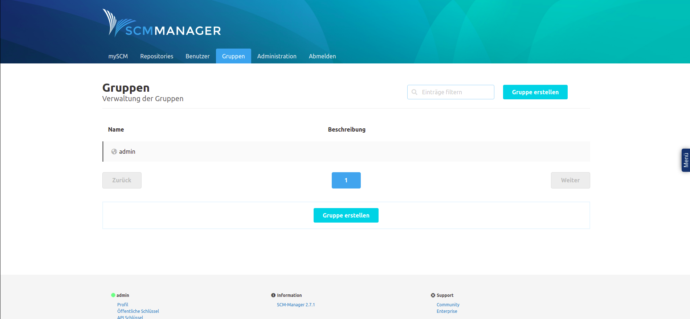

Now enter the name of the group and a description into the form and activate the checkbox "External".
Important: The name of the group must exactly match the name of the group in User Management.

Then click on "Save" to create the group.

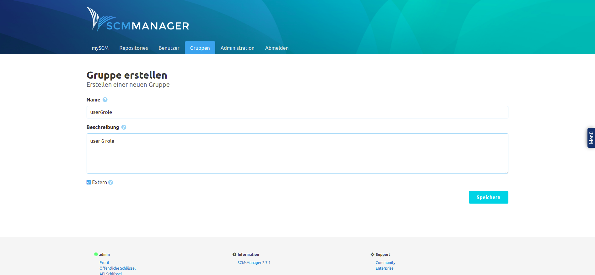

The group can now be authorized.

### General authorization of a user in SCM-manager
Click on the "Users" tab and select the user you want to authorize from the list of users.

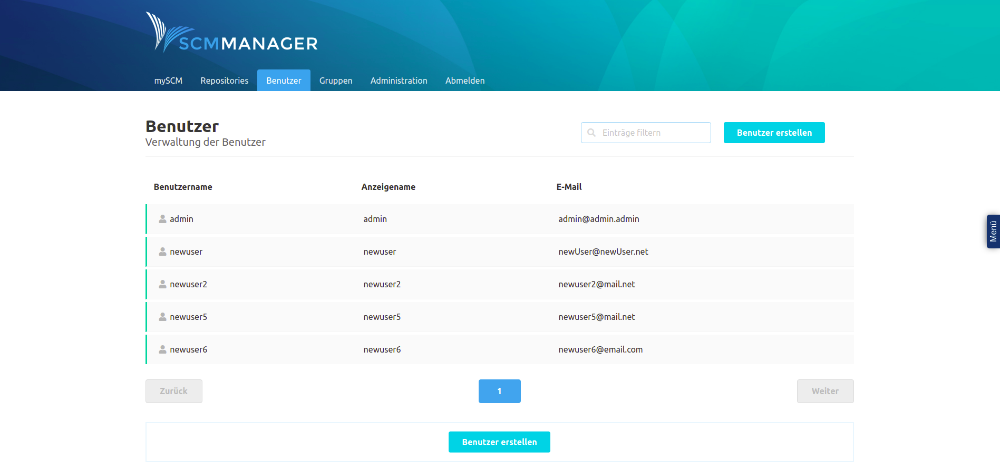

Then click on "Settings", then on "Permissions".

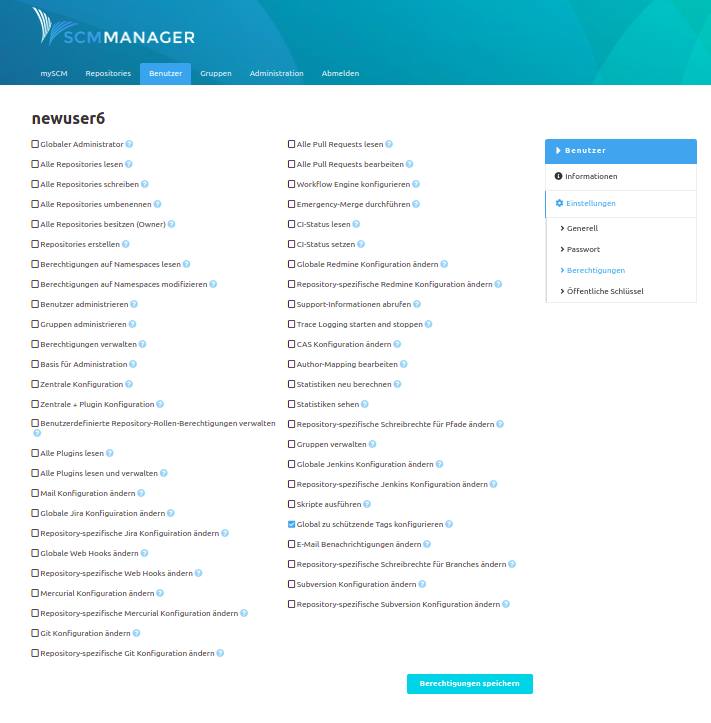

From there, select the privileges you want the user to have and click on "Save Privileges".

### General authorization of a group in SCM-manager
Click on the "Groups" tab and select the group you want to authorize from the list of groups.

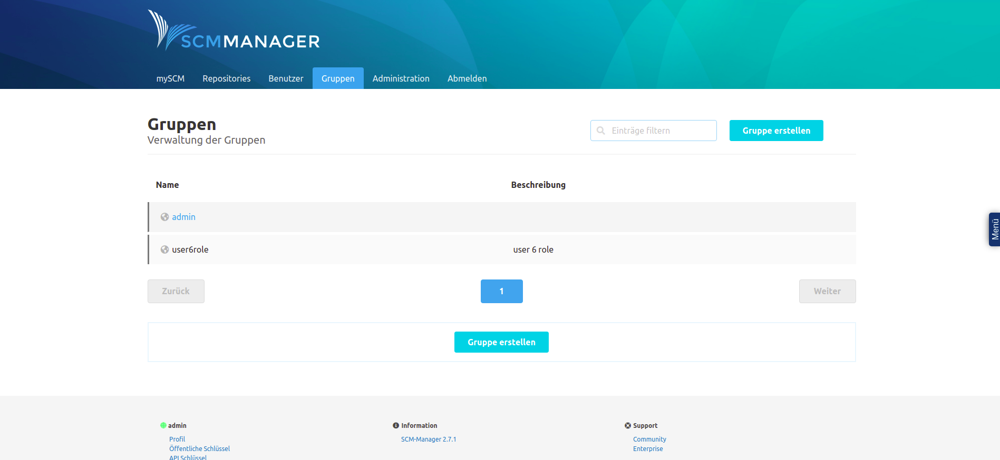

Then click on "Settings", then on "Permissions". There select the permissions you want to give to the group and click on "Save permissions".

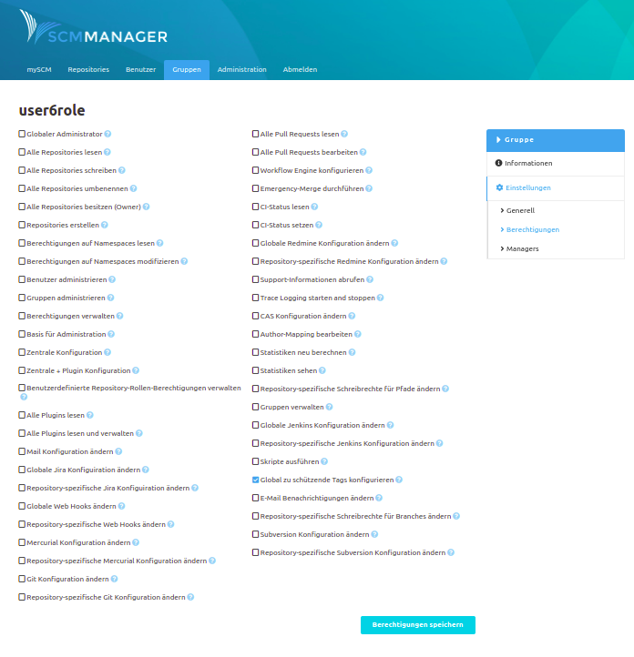

The permissions are now effective for the user.

### Permission of a user or group for a specific repository.

Go to your repository's page, click "Settings" there, and then click "Permissions".

Under the "Add new permission" heading, select either "User permission" or "Group permission",
depending on whether the new permission is to be created for only one user or for a group.
Now write the name of the user or group to be authorized in the "User" or "Group" field.

Now you have the possibility to assign a predefined role to the user or group, where the user or group gets a predefined set of permissions.
For this select an entry from the "Role" list.

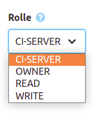

Alternatively you can define each permission yourself. To do so, click on the "Advanced" button. A dialog opens.
There you select the permissions the user should get and click on "Save".

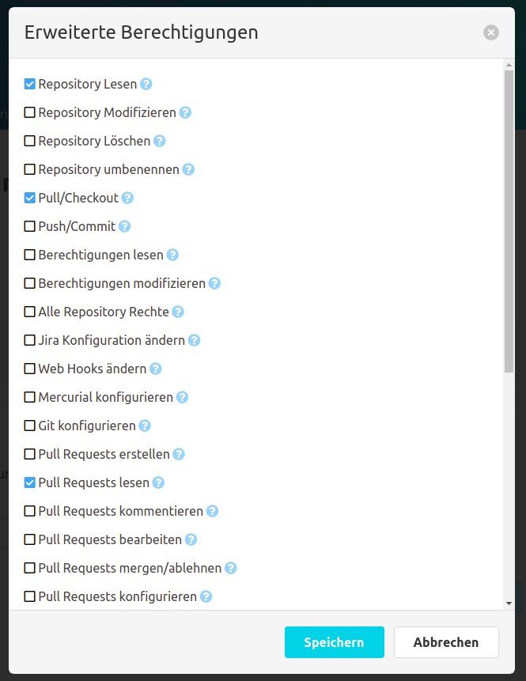

Once you have added all the desired permissions, click "Save".
The user or group now has the permissions you selected for the repository you selected.

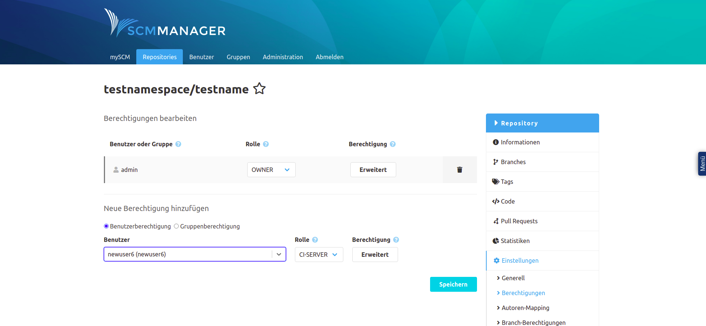

The new permissions are now effective.

## Example: Permissions Nexus Dogu
For this example, the user "newuser6" with the group "user6role" was created in User Management in advance.

### Optional: Create a new role
This step can be skipped if the user to be authorized has already logged in.

Click on the cogwheel to get to the administrators area. There click on "Roles", "Create role" and then on "Nexus role".
then on "Nexus role".

In the now visible form enter a "Role ID" and a "Role name". It is important that the value in the
Role ID" field corresponds exactly to the name of the group to be authorized in User Management.
Then press "Create role".

The role is now created and can be assigned to a user.

### Optional: Create a user
This step can be skipped if the user to be authorized has already logged in.

Click on the cogwheel to get to the administrators area. There click on "Users
and then on "Create local User".

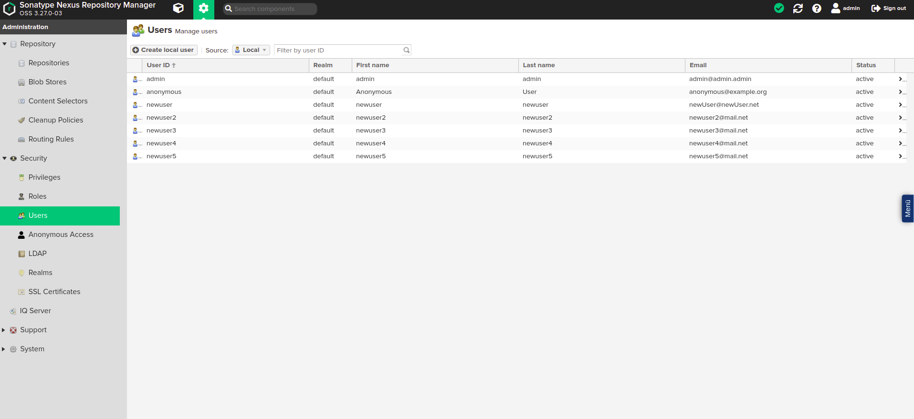

In the now visible form enter the data of the user. It is important that the value in the field "ID" is exactly
corresponds to the user name of the user to be authorized.

Give the user the role you created. The other values will be overwritten with the values from User Management when the user logs in. Now click on "Create local User".

The user is now created and can be authorized.

### Authorize a role in the Nexus
Select the role to be authorized in the role overview.

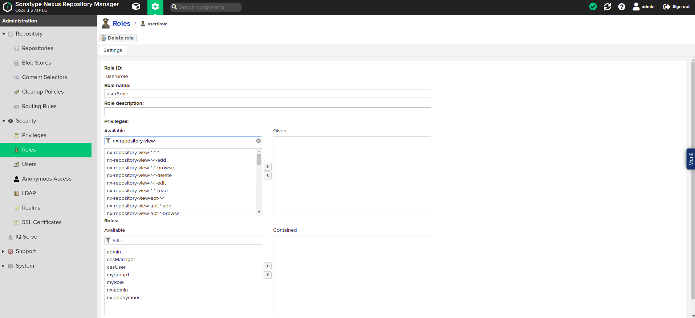

Under the heading "Privileges:" privileges can now be assigned to this role.

The most important privileges for a user are:
* nx-repository-view-*-*-browse (user can see existing repositories).
* nx-repository-view-*-*-read (user can see the contents of existing repositories)
* nx-repository-view-*-*-edit (user can modify the content of existing repositories)
* nx-repository-view-*-*-delete (user can delete the content of existing repositories)
* nx-repository-admin-*-*-browse (user can view existing repositories in the administration area)
* nx-repository-admin-*-*-add (user can add new repositories in the administration area)
* nx-repository-admin-*-*-edit (user can change configuration of existing repositories in administration area)
* nx-repository-admin-*-*-delete (user can delete repositories in the administration area)

Under the heading "Roles:" additional roles can be added to this role. The permissions of the added
roles are now also available for this role.

If you want to give a role access to a specific repository, there are special privileges for it.
They are automatically created according to the naming scheme `nx-repository-<privileg-type>-<repository-type>-<repositoryName>-<action>`,
as soon as a new repository is created.

#### \<privileg-type>.
The type of a privilege can be either "admin" or "view".
If the type is "view", the privilege applies to the normal user area.
If the type is "admin", the privilege refers to the administration area.

#### \<repository-type\>
This is the type of the repository. The type of a repository is set when it is created. For example, this can be "docker" or "raw".

#### \<repositoryName\>
This is the name of the created repository.

#### \<action\>
The action can be "delete", "browse", "read", "edit" or "*".
The "delete" action refers to deleting actions.
The "browse" action refers to actions that e.g. display repository lists
The action "read" refers to read accesses
The action "edit" refers to editing accesses
The "\*" action refers to all previously mentioned actions.

#### Examples:
The privilege "nx-repository-view-raw-testrepo-browse" has the effect that a user with this privilege can see the repository "testrepo" in the list of existing repositories.

The "nx-repository-admin-raw-testrepo-browse" privilege has the effect that a user with this privilege can see the "testrepo" repository in the list of existing repositories in the administration area.

The "nx-repository-view-raw-testrepo-read" privilege has the effect that a user with this privilege can read content from the "testrepo" repository.

#### Creating privileges manually
Alternatively, you can create your own privilege where specific actions can be specified.
To do this, click on "Privileges" in the administration area and then on "Create privilege".

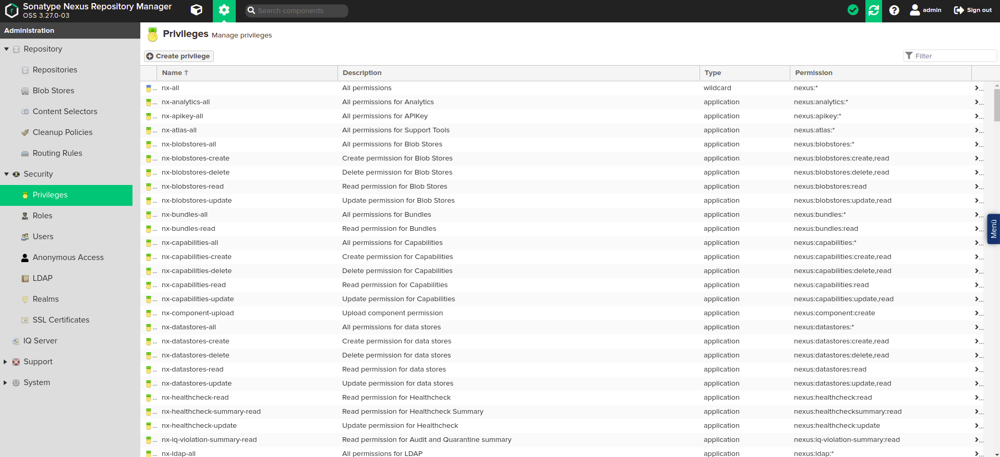

There select the entry "Repository View" to privilege users for the normal area or the entry "Repository Admin",
to authorize a user for the administration area.

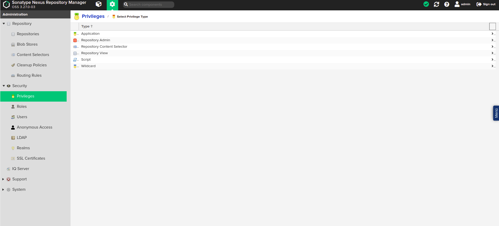

You will now be presented with a form. Fill it out as explained below and then click on "Create privilege".
Afterwards you can add the privilege to a role as described above.

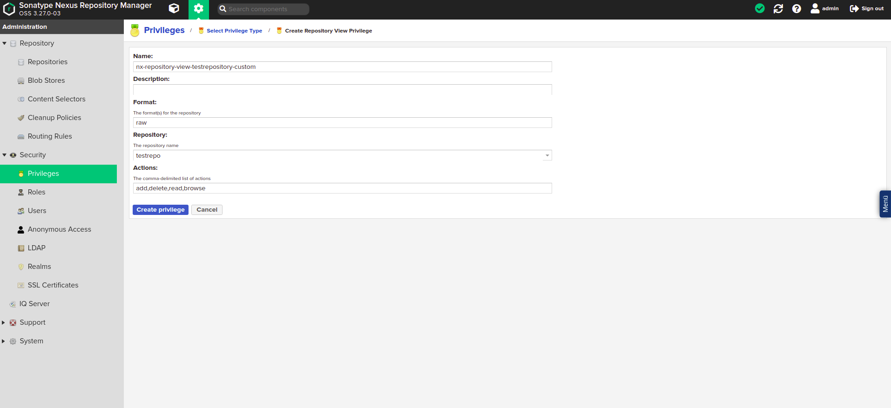

#### Name
A freely selectable name for the privilege. Under this name the privilege will be found later in the list of privileges.

#### Description
A freely selectable description for the privilege.

#### Repository
Here you select your desired repository from a list.

#### Actions
The actions that should be executable for the repository. These can be entered here separated by commas.

#### Format
The format of the repository for which the privilege should grant permission. If you are not sure what format your repository has, you can look it up in the list of repositories.

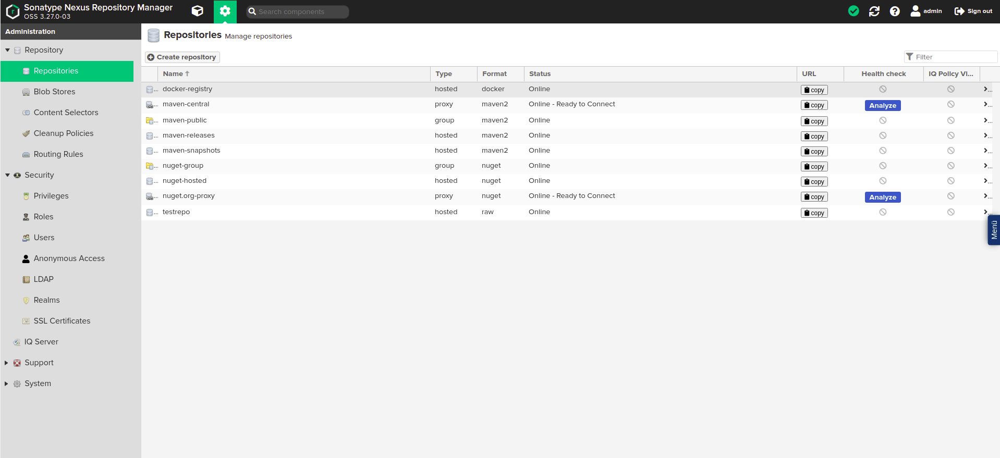

The privilege can now be assigned to a role as described above.

## Jenkins / CAS Plugin

In the *Manage Jenkins* area, all installed Jenkins plugins can be accessed via the *Manage Plugins* subitem. These are displayed in the *Installed* tab.

Users with administration rights can uninstall plugins here according to their dependencies. Please note that the **CAS plugin is operationally necessary** and must therefore never be uninstalled. If this plugin is removed, it will no longer be possible to start the Jenkins Dogus.

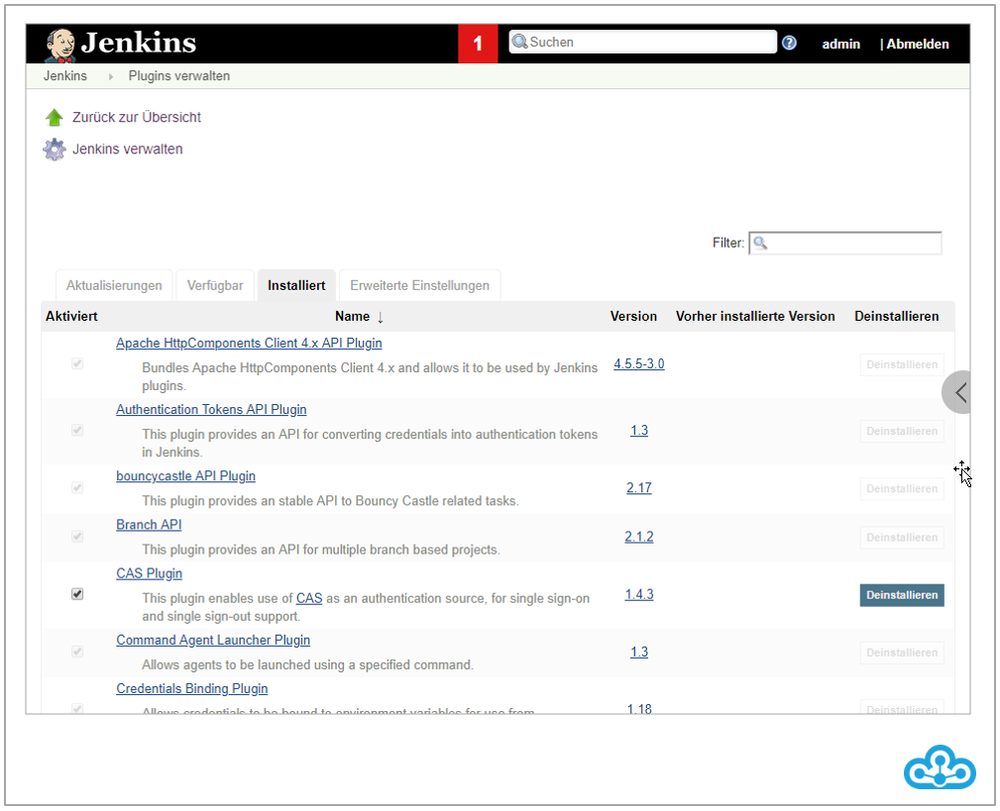

