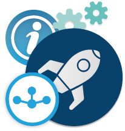

# Cloudogu EcoSystem via VirtualBox installieren

Hallo und vielen Dank für Ihr Interesse an unserem [Cloudogu EcoSystem](https://cloudogu.com/de/ecosystem/). Sollten Sie Anregungen oder Fragen haben, kontaktieren Sie uns gerne via <a title="E-Mail an Cloudogu senden" href="mailto:hello@cloudogu.com?subject=Hello%20Cloudogu">hello@cloudogu.com</a> oder telefonisch unter <a title="Cloudogu anrufen" href="tel:+4953161808880">+49. 531. 61 80 88 80</a>.

## Wie erhalten Sie Ihr Image?

Der einfachste Weg zu einem Cloudogu EcoSystem (CES) ist der Download eines Images über die myCloudogu Plattform.
Für den Download benötigen Sie lediglich einen kostenlosen Account, der anschließend auch für die Registrierung der Instanz während der Installation genutzt werden kann.

<a class="button" href="https://cloudogu.com/de/ecosystem/download/" target="_blank" rel="noreferrer" title="Zum Download">Zum Download</a>

---

## Vorbereitungen

Um mit dem [Cloudogu EcoSystem](https://cloudogu.com/de/ecosystem/) zu starten, benötigen Sie eine Virtualisierungsumgebung, um die Plattform zu betreiben. Idealerweise besitzen Sie eine leistungsstarke lokale Maschine oder verfügen über bereitgestellte Hardware in einem Rechenzentrum.

Ihr Hoster hält vermutlich eine Anleitung bereit, wie Sie Images von Dritten in Ihr System laden und verwenden können.
Sollten Sie das Image nicht in einer Serverumgebung betreiben, können Sie eine dieser Virtualisierungsumgebungen nutzen.
* [VirtualBox](https://www.virtualbox.org/)
* [QUEMU](https://www.qemu.org/)

---

## Durchführen des Setups

Nachdem Sie das Image in Ihrer Virtualisierungsumgebung importiert und gestartet haben können Sie mit dem Setup beginnen.

### Aufruf des Setup-Wizard

Die Maschine steht Ihnen in der Regel über die Website `http://192.168.0.56:8080` für das Setup zur Verfügung. Sollte dies nicht der Fall sein, wurde der Maschine von Ihrem Netzwerk eine andere IP zugewiesen. Um die IP herauszufinden müssen Sie sich über das CLI anmelden. Die Logindaten sind der Username `ces-admin` mit dem Passwort `ces-admin`. **Hinweis:** Das Standard-Keyboard-Layout ist Englisch, das “-” ist auf der „ß“wsl -Taste. **Wichtig:** Das Passwort des Users ces-admin wird am Ende des Setup-Prozesses durch eine zufällig generierte Zeichenfolge ersetzt, die Ihnen dann mitgeteilt wird.

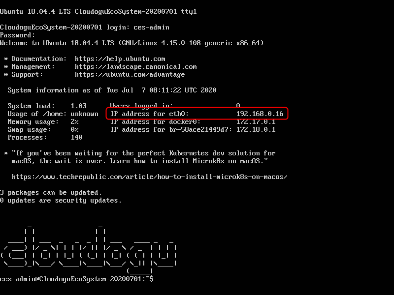

Nach dem Login wird die IP der Maschine angezeigt und Sie können den Setup-Wizard unter `http://ip-adresse:8080` beginnen.

### Registrierung (CES Instance Registration)

Nun können Sie das Setup mit „Register Instance“ starten. Durch die Registrierung bekommen Sie Zugriff auf die von uns bereitgestellten Dogus.

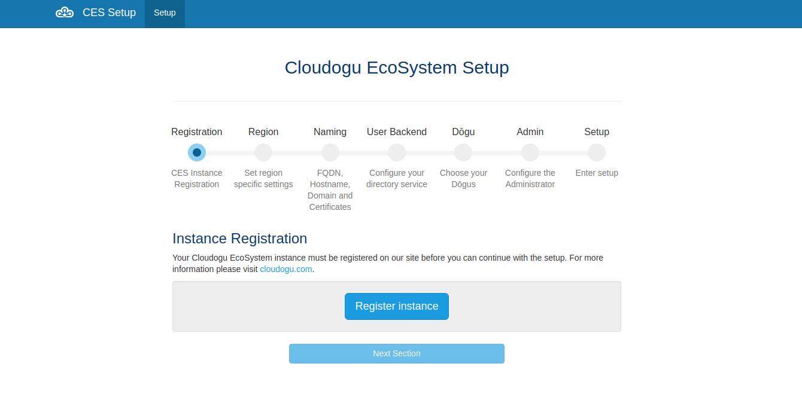

Um Ihre Instanz zu registrieren, können Sie Ihren myCloudogu Account nutzen. Alternativ können Sie sich auch mit einem GitHub- oder Google-Account anmelden oder einen neuen Account registrieren.

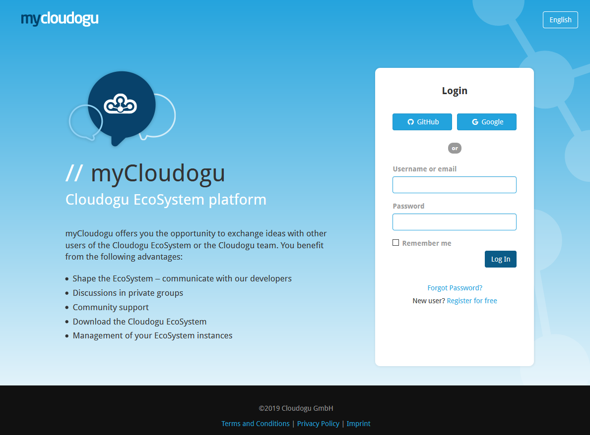

Bestätigen Sie anschließend die Registrierung Ihrer Instanz unter Ihrem Account.

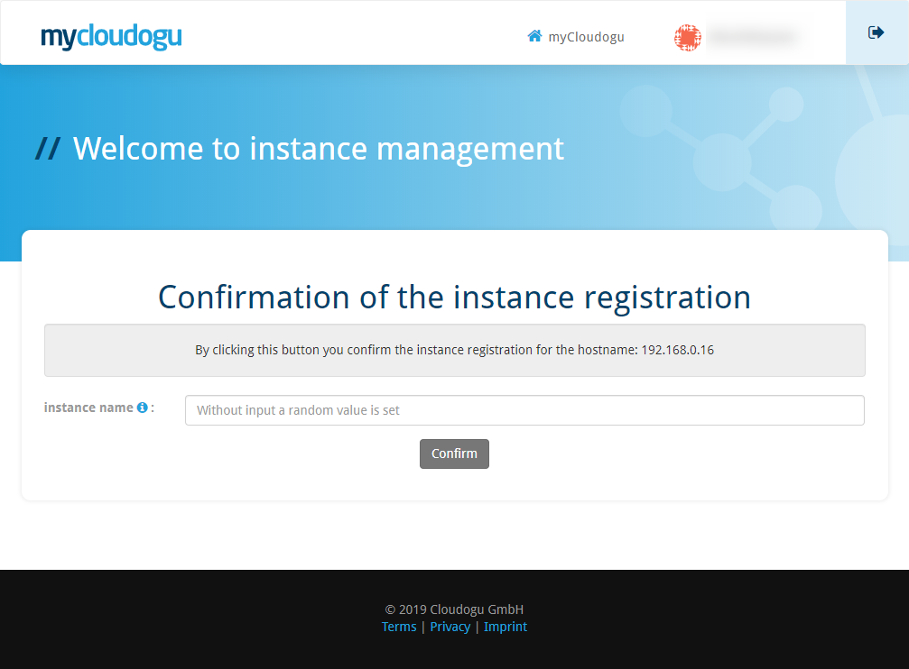

### Region (Set region specific settings)

Nach der Registrierung beginnt die Konfiguration Ihrer Instanz. Der erste Schritt ist die Festlegung der Region Ihrer Instanz.

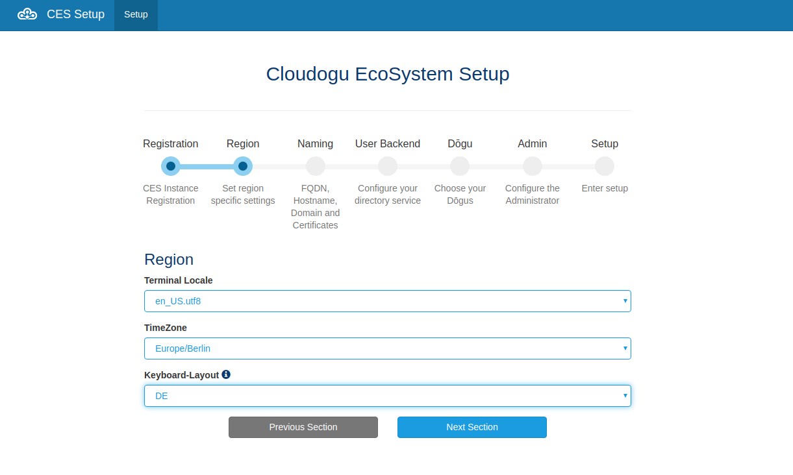

### Naming (FQDN, Hostname, Domain and Certificates)

Im nächsten Schritt werden Informationen zur Erreichbarkeit Ihrer Instanz und dem E-Mail-Versand benötigt.

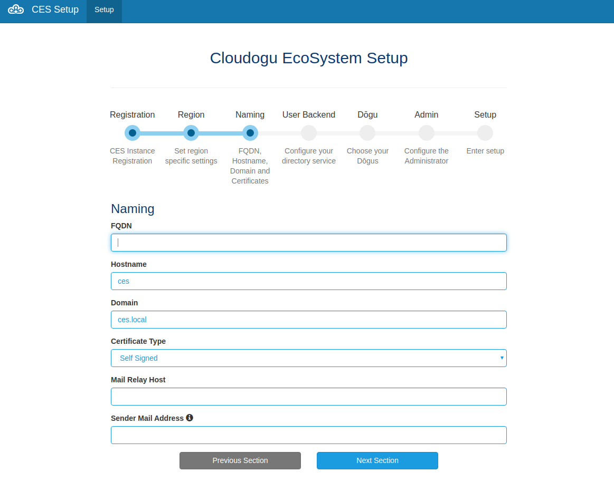

**Hinweis FQDN:** Die „FQDN“ zeigt standardmäßig die IP-Adresse des virtuellen Systems an. Sie können die „FQDN“ auch ändern, indem Sie z.B. eine firmeneigene URL eintragen. Empfehlenswert ist eine Zusammensetzung aus „Hostname“ und „Domain“. Wenn kein FQDN angegeben wird, ist das CES nur über die IP erreichbar.

**Hinweis Certificate Type:** Wenn Sie noch keine Zertifikate für Ihre Instanz haben, können Sie „Self Signed“ auswählen. Für einen produktiven Betrieb empfehlen wir jedoch, dass Sie Third Party Zertifikate benutzen.

**Hinweis Mail Relay Host:** Nur wenn ein gültiger Mailserver angegeben ist kann das Cloudogu EcoSystem E-Mails verschicken. Der Mail Relay Host kann sowohl als URL als auch als IP-Adresse angegeben werden. Auch ein inkorrekter Mail Relay Host, bspw. für Testzwecke, ist möglich.

### User Backend (Configure your directory service)

Wählen Sie bitte die gewünschte Nutzerverwaltungsdatenbank. Wir liefern Ihnen eine implementierte Version direkt mit. Sollten Sie bereits ein eigenes LDAP oder Active Directory zur Verfügung haben, können Sie dieses selbstverständlich anbinden und konfigurieren.

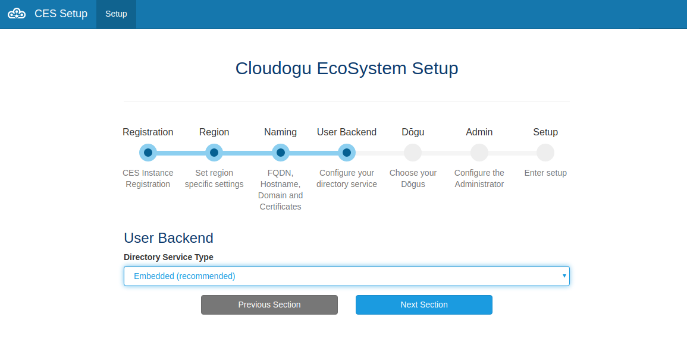

### Dogu (Choose your Dogus)

Suchen Sie Ihre Werkzeuge (Dogus) aus und legen Sie ein Dogu als Startseite nach dem Login (Default Dogu) fest. Bei Fragen können Sie sich jederzeit an uns wenden.

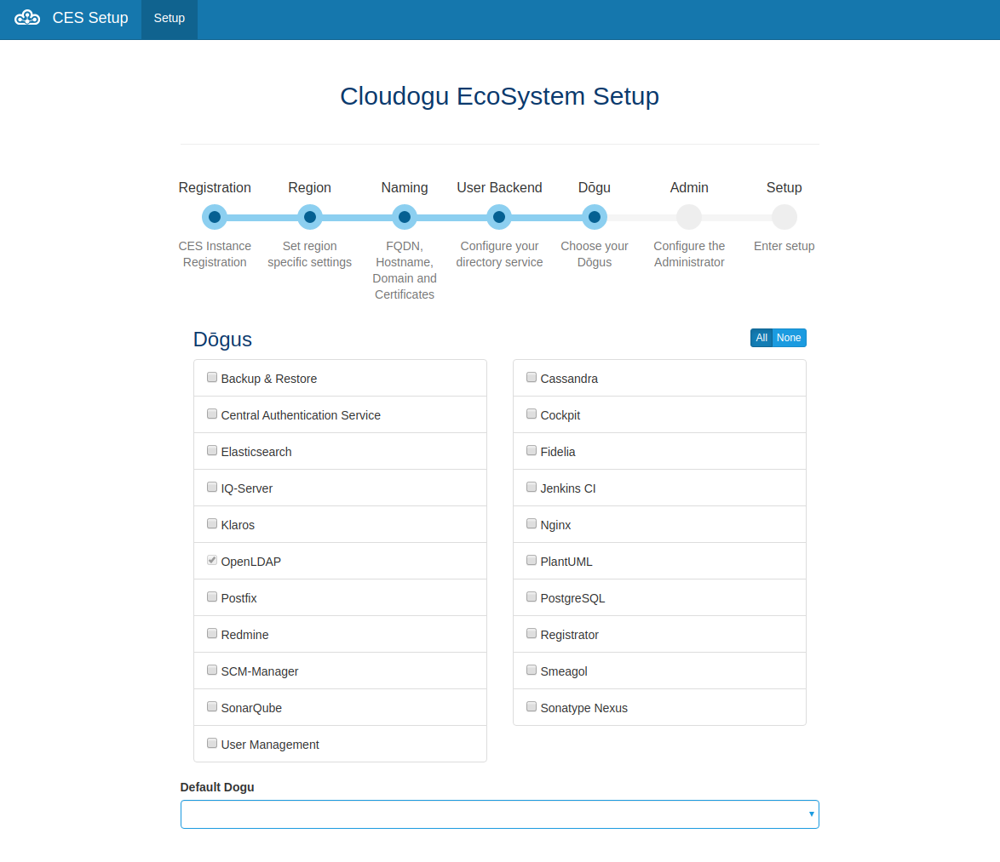

Sollten Sie Bedarfe haben die mit unserem Community Angebot nicht gedeckt sind, bieten wir Ihnen maßgeschneiderte Kooperationsverträge an. Hierzu zählt auch die Implementierung von weiteren Dogus, die Ihre Bedürfnisse komplettieren.

* <a target="_self" title="Informationen zu unseren Dogus" href="https://cloudogu.com/de/ecosystem/tools/">Informationen zu unseren Dogus</a>
* <a target="_self" title="Informationen zum Pricing" href="https://cloudogu.com/de/ecosystem/preise/">Preisinformationen</a>
* <a target="_self" title="EcoSystem FAQ" href="https://cloudogu.com/de/ecosystem/faq/">EcoSystem FAQ</a>
* <a target="_self" title="Datenschutzerklärung" href="https://cloudogu.com/de/privacy/">Datenschutzerklärung</a>

**Hinweis:** Abhängigkeiten zwischen Dogus werden automatisch berücksichtigt. Wenn Sie also z.B. „Jenkins CI“ auswählen, werden automatisch auch „Central Authentication Service“, „Nginx“, „Postfix“ und „Registrator“ ausgewählt, da diese für den Betrieb von Jenkins benötigt werden.

In dem Default Dogu Feld können Sie auswählen welches Dogu nach dem Login an Ihrem Cloudogu EcoSystem als erstes angezeigt werden soll. Diese Einstellung gilt für alle Nutzer der Plattform.

**Hinweis:** Für die Community Edition des Cloudogu EcoSystem stehen keine Premium Dogus, wie z.B. „Backup & Restore“ zur Verfügung.

### Admin (Configure the Administrator)
Im letzten Schritt der Konfiguration legen Sie den ersten User Ihres Cloudogu EcoSystem und einen Gruppennamen für Administratoren fest.

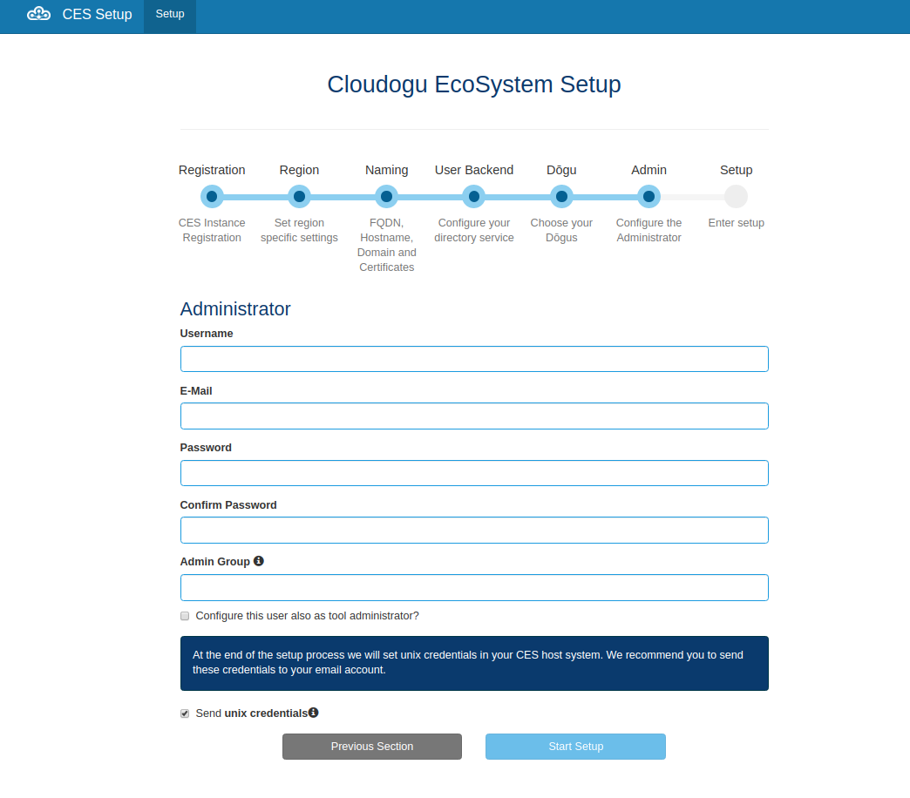

**Hinweis:** Die Administratorengruppe (Admin Group) ist eine voreingestellte Gruppe des eingebetteten Directory Service, welche den Mitgliedern Administrationszugriff auf die installierten Tools gibt.

Um Ihren User auch als Administrator in den Dogus zu berechtigen, wählen Sie die Checkbox „Configure the user also as tool administrator“ aus.

**Hinweis:** Sollten Sie dem ersten User keine Administratorrechte geben, hat der User trotzdem die Rechte um weitere Benutzer in dem eingebetteten Directory Service anzulegen und Administratorrechte zu vergeben.

Wenn Sie einen gültigen Mail Relay Host angegeben haben, können Sie optional die automatisch generierten UNIX-Zugangsdaten an die hinterlegte E-Mail-Adresse senden lassen. Unabhängig davon werden diese nach Abschluss der Installation einmalig angezeigt.

### Setup

In der letzten Phase sehen Sie, wie die Installation mit der von Ihnen vorgenommen Konfiguration Schritt für Schritt abgearbeitet wird.

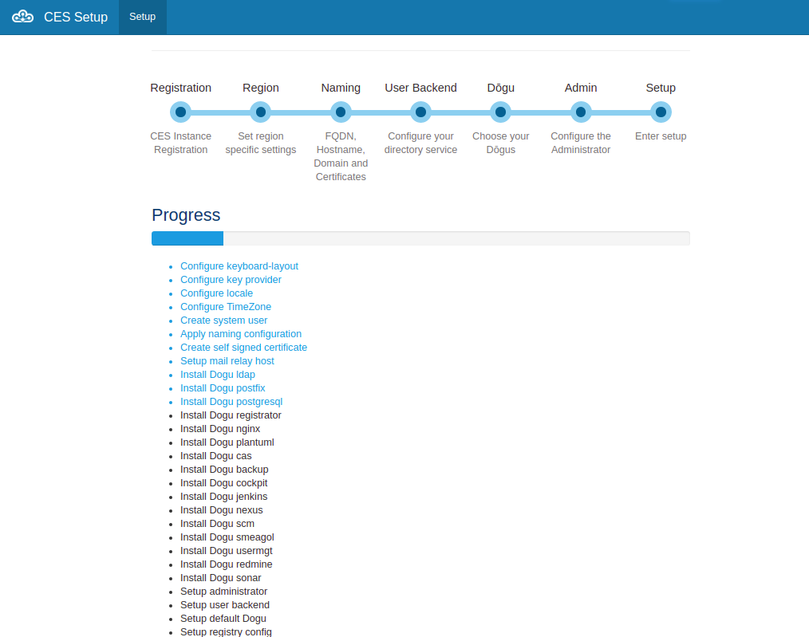

Nach Vollendung des Setup-Prozesses werden Ihnen einmalig Ihre UNIX-Zugangsdaten angezeigt. **Sichern Sie sich diese Daten sorgfältig.**

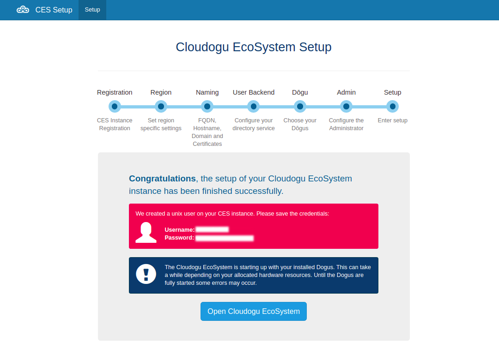

Sie können über den angebotenen Link direkt ins Cloudogu EcoSystem navigieren. Je nachdem wie performant ihre Maschine ist, kann es einige Minuten dauern bis alle Dogus gestartet sind und Sie sich anmelden können.

Damit ist die Installation Ihres Cloudogu EcoSystem abgeschlossen. Sie können nun damit beginnen Benutzer und Daten zum System hinzuzufügen.

---

## Ein kurzer Einstieg in das Cloudogu EcoSystem

Je nachdem welche Dogus sie ausgewählt haben, steht Ihnen nun eine umfangreiche Auswahl an unterschiedlichen Werkzeugen zur Verfügung.

**Wichtig:** Beachten Sie den Pfeil am rechten mittleren Bildschirmrand. Mit dieser Seitennavigationsleiste gelangen Sie auf die installierten Dogus.

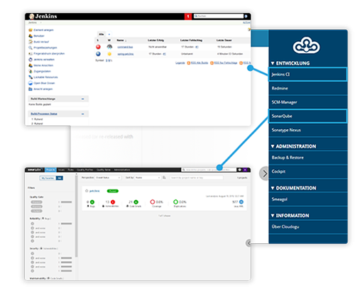
