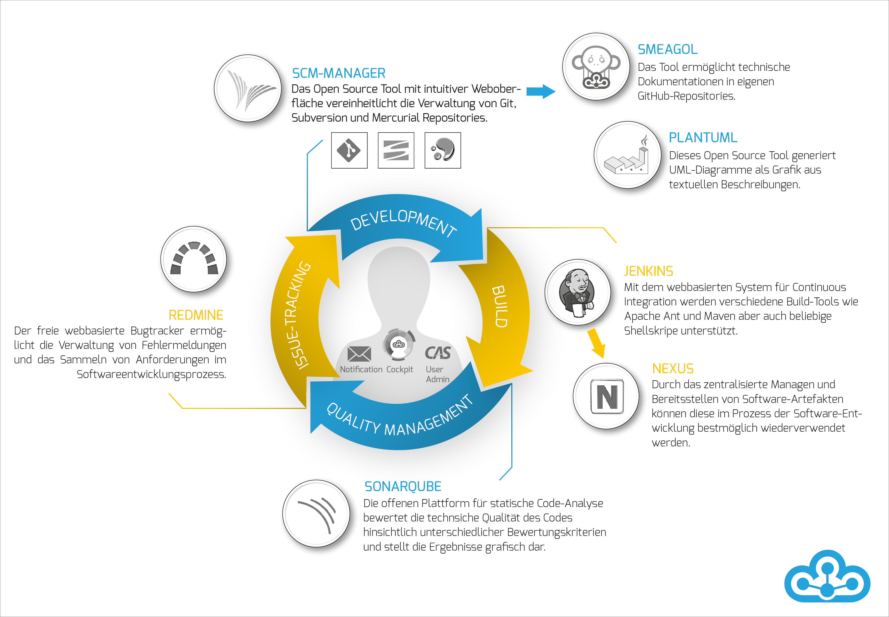

# Introduction

## What is the Cloudogu EcoSystem?
The Cloudogu EcoSystem is a platform that gives development teams the freedom to decide when and where they develop software. To do this, each service and tool is deployed as a so-called dogu and automatically aligned and configured.
As a result, the Cloudogu EcoSystem holds a number of benefits for software developers:

* a central authentication service
* dynamic navigation between the Dogus
* cross-Dogu automated processes, from commit messages to project builds
  * a push of changes automatically leads to the build of the project
  * by using keywords in commit messages, the status of tickets can be changed in Redmine as well as comments can be added.

## Single sign-on
Workflows in the Cloudogu EcoSystem are particularly fluid thanks to the integrated single sign-on (SSO). This means that users can switch between the Dogus at will without having to log in again. For single sign-on, you can use your own directory services or install a local directory service. This integrated directory service can be managed via a separate dogu.

Feature overview:

* fully integrated SSO via all available dogus.
* in addition to SSO via the browser, the authentication mechanism can also be used via tools, e.g. for a seamless IDE connection
* centralized user management (see User Management) and consistent use of groups

## Security
The Cloudogu EcoSystem has been developed with a constant eye on current security standards. The strict use of SSL to encrypt connections and the encapsulation of each Dogus in containers as well as the encryption of security relevant configurations are just a few of the measures that have been incorporated into the design.

Excerpt from the security measures:

* Exclusively SSL-encrypted connections possible.
* self signed certificates for internal use, integration of own certificates for productive use via setup possible
* isolated environment for each installed dogu (one container per dogu)
* encrypted storage of sensitive information within the dogus (one key pair per dogu)
* dedicated systemic access permissions for tool access and tool communication respectively

## Technological environment
The Cloudogu EcoSystem is based on a Linux image provided for various virtualization environments. The installation can be done manually via a browser or automatically via a parameter file, which installs the dogus realized as Docker containers. The individual containers are configured centrally via specially programmed middleware. The images or versions of the Dogus can be deployed both online and "on premise" as a mirror, so that no Internet connection is required.

* Linux-based image - creation with packer for target environments (VMware, VirtualBox, QEMU)
* Manual configuration or via automatic parameterization via JSON file for cloud environments.
* realization of Dogus with Docker
* central configuration management via Etcd
* Availability of the Dogus via online repository (Cloudogu) or mirror (offline/online).
