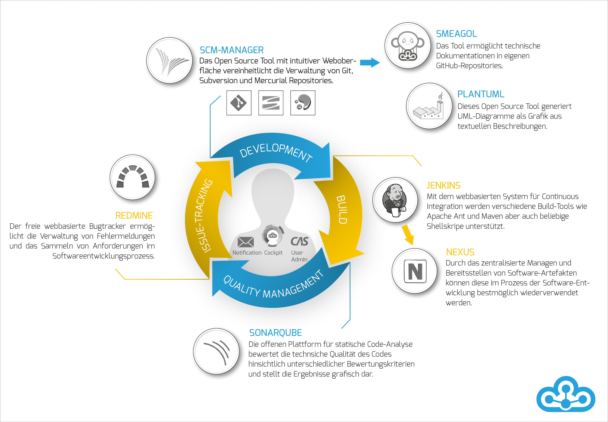

# Einleitung
## Was ist das Cloudogu EcoSystem?
Das Cloudogu EcoSystem ist eine Plattform, die Entwicklungsteams die Freiheit gibt, selbst zu entscheiden, wann und wo sie Software entwickeln. Dazu werden jeder Service und jedes Tool als ein sogenanntes Dogu bereitgestellt und automatisch aufeinander abgestimmt und konfiguriert.
Dadurch hält das Cloudogu EcoSystem eine Reihe von Vorzügen für Softwareentwicklerinnen und Softwareentwickler bereit:

* einen zentralen Authentifizierungsservice
* eine dynamische Navigation zwischen den Dogus
* Dogu übergreifende automatisierte Prozesse, von den Commit-Nachrichten bis zum Build des Projekts
  * ein Push von Änderungen führt automatisch zum Build des Projekts
  * durch die Verwendung von Schlüsselwörtern in Commit-Nachrichten kann sowohl der Status von Tickets in Redmine geändert, als auch Kommentare hinzugefügt werden.

## Single Sign-on
Arbeitsabläufe im Cloudogu EcoSystem gestalten sich durch das integrierte Single Sign-on (SSO) besonders flüssig. So kann beliebig zwischen den Dogus gewechselt werden, ohne dass eine erneute Anmeldung nötig wird. Für das Single Sign-on können eigene Verzeichnisdienste verwendet oder es kann ein lokaler Verzeichnisdienst mit installiert werden. Dieser integrierte Verzeichnisdienst kann über ein eigenes Dogu verwaltet werden.

Funktionsübersicht:

* vollständig integriertes SSO über alle verfügbaren Dogus
* zusätzlich zum SSO über den Browser kann der Authentisierungsmechanismus auch über Tools, z.B. für eine nahtlose IDE-Anbindung, verwendet werden
* zentrales Benutzerinnen- und Benutzermanagement (siehe User Management) und durchgängige Verwendung von Gruppen

## Sicherheit
Das Cloudogu EcoSystem wurde mit stetigem Blick auf aktuelle Sicherheitsstandards entwickelt. Die strikte Verwendung von SSL zur Verschlüsselung von Verbindungen und die Kapselung jedes Dogus in Container sowie die Verschlüsselung von sicherheitsrelevanten Konfigurationen sind nur ein Auszug aus den in den Entwurf eingeflossenen Ma\ss nahmen.

Auszug aus den Sicherheitsma\ss nahmen:

* ausschlie\ss lich SSL-verschlüsselte Verbindungen möglich
* selbst signierte Zertifikate für interne Verwendung, Integration eigener Zertifikate für produktiven Einsatz über Setup möglich
* isolierte Umgebung für jedes installierte Dogu (ein Container pro Dogu)
* verschlüsselte Ablage sensibler Informationen innerhalb der Dogus (ein Schlüsselpaar pro Dogu)
* dedizierte systemische Zugriffsberechtigungen für den Zugriff auf Tools bzw. für die Tool-Kommunikation

\pagebreak

## Technologisches Umfeld
Das Cloudogu EcoSystem basiert auf einem Linux-Image, welches für verschiedene Virtualisierungsumgebungen bereitgestellt wird. Die Installation kann sowohl manuell über einen Browser als auch automatisch über eine Parameterdatei erfolgen, die die Installation der als Docker-Container realisierten Dogus vornimmt. Die einzelnen Container werden über eine eigens dafür programmierte Middleware zentral konfiguriert. Die Abbilder bzw. Versionen der Dogus können sowohl online als auch "on Premise" als Mirror bereitgestellt werden, so dass keine Internet Verbindung benötigt wird.

* Linux-basiertes Image – Erstellung mit Packer für Zielumgebungen (VMware, VirtualBox, QEMU)
* manuelle Konfiguration oder über automatische Parametrisierung per JSON-Datei für Cloud-Umgebungen
* Realisierung der Dogus mit Docker
* zentrales Konfigurationsmanagement über Etcd
* Verfügbarkeit der Dogus über online-Repository (Cloudogu) oder Mirror (offline/online)
