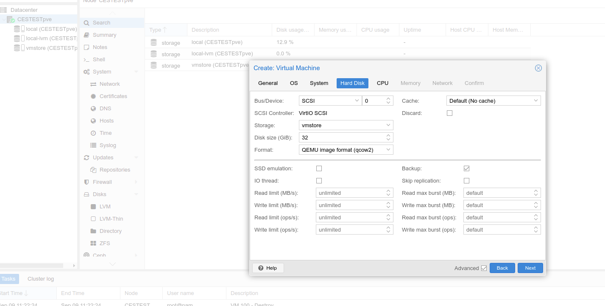
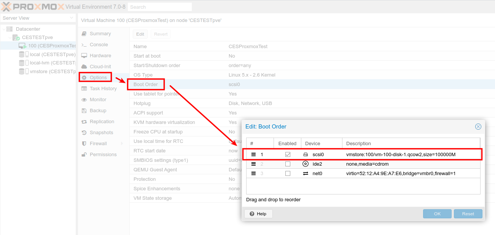
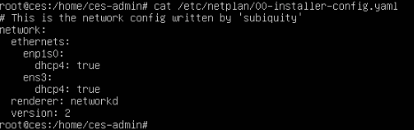
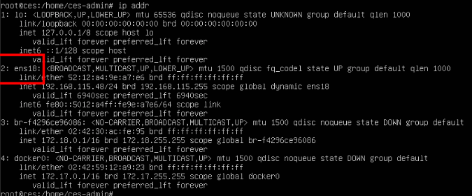

# CES auf einem Proxmox Hypervisor betreiben
In der folgenden Anleitung soll erklärt werden wie man ein Cloduogu Ecosystem auf einem Proxmox Hypervisor betreiben kann.
### Voraussetzungen:
* Laufender Proxmox Hypervisor
* Heruntergeladenes Image (vorzugsweise das [Qemu-Image](https://files.cloudogu.com/file/ces-images/qemu/latest). Auf dieses beziehen sich die folgenden Hinweise zur Netzwerkkonfiguration)
* Storage in Proxmox angelegt der zum verwendeten Disk-Image passt.
* Mindestens 100 GB Platz auf besagtem Storage.

## Storage
der Storage muss zum Disk-Image passen. Wir haben einen storage vom Typ `directory` passend zu unserem (QEMU) `qcow2` Image gewählt. Der [Storagetype](https://pve.proxmox.com/wiki/Storage) **muss** aber je nach verwendetem Image passend gewählt werden.

## Import
Das heruntergeladene Image muss auf den Proxmox hochgeladen werden. Dazu kann bspw. ein FTP-Client wie FileZilla genutzt werden. Liegt das Image auf dem Server kann es mit dem Befehl `tar xvf {Image}` entpackt werden (hier also `tar xvf ces-images_qemu_CloudoguEcoSystem-20210902.tar`). Nach dem entpacken unseres QEMU Images liegt nun ein `qcow2` Image vorl. Danach sollte das Image welches importiert wird noch dem jeweiligen Nutzer zugeordnet werden
`chown root.root CloudoguEcoSystem-20210902.qcow2` (hier der **root** User).

### VM erstellen
Liegt das Image nun entpackt und dem korrekten Nutzer zugeordent vor legen wir eine neue VM an. Hier können größtenteils die jeweiligen Standardeinstellungen verwendet werden. Merken sie sich die VM Id (diese benötigen wir später nocheinmal) aus dem ersten Reiter `General`. Es sollte nur darauf geachtet werden das genügend RAM (>4GB) und besstenfalls CPU Kerne mehr als ein CPU Kern zur verfügung stehen. Im Reiter `Hard Disk` muss außerdem das Format der Disk mit dem des Images übereinstimmen.

Nachdem die VM angelegt wurde kann noch die default Disk (standardmäßig mit der Id 0) unmounted werden.
Mit dem Befehl `qm importdisk {VM-Id} {Imagename} {Storagename} -format {Imageformat}` können wir nun das Image mounten (In unserem Beispiel also: `qm importdisk 100 CloudoguEcoSystem-20210902.qcow2 vmstore -format qcow2`). Nachdem der Befehl erfolgreich ausgeführt wurde finden wir im Hardwaretab unserer VM eine neue ungenutze Disk ( bspw. `'unused1:vmstore:100/vm-100-disk-1.qcow2'`). Mit einem Doppelklick auf diese Disk im Hardwaretab können wir die Disk attachen.
Nun muss noch die Bootreihenfolge eingestellt werden damit die Proxmox VM auch von dem eben importieren Image bootet. Dazu gehen wir in der VM auf den Reiter `Options`>`Boot Order` und geben dort unsere frisch gemountetes Image an der ersten Stelle an.

## Start
Das Image kann nun über die Start Schaltfläche in Proxmox gestartet werden. Wechseln sie in die Konsole. Bootet die VM korrekt sollten sie eine Kommandzeile sehen. Das default Passwort für den root-User lautet `ces-admin`.

## Netzwerkkonfiguration
In der Console gilt es nun die Netzwerkkonfiguration korrekt zu hinterlegen. Standardmäßig legt das Image eine Netzwerkkonfiguration mit netplan in die Datei `/etc/netplan/00-installer-config.yaml`. Die die Netzwerkschnittstelle `enp1s0` enthält.

Diese ist aber stark vom betreibenden Hypervisor abhänig und muss möglicherweise geändert werden. Verwedenen sie dazu den
Befehl `ip addr` um alle verfügbaren Netzwerkscnittstellen anzuzeigen.

In unserem Fall fehlt der Eintrag für die Netzwerkschnittstelle `ens18`. Fügen sie diese in der `/etc/netplan/00-installer-config.yaml` hinzu.

**Nun sollte Ihr Cloudogu Ecosystem vollständig konfiguriert und damit nutzbar sein**
