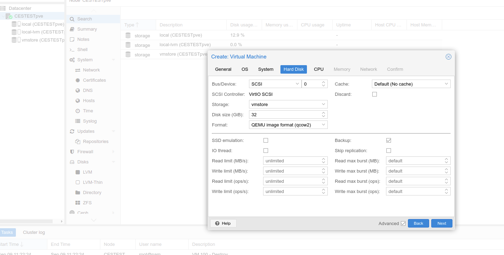
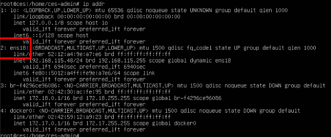

# Running CES on a Proxmox Hypervisor
The following instructions explain how to run a Cloduogu Ecosystem on a Proxmox Hypervisor.
### Requirements:
* Running Proxmox Hypervisor.
* Downloaded image (preferably the [Qemu image](https://files.cloudogu.com/file/ces-images/qemu/latest). The following notes on network configuration refer to this image).
* Storage created in Proxmox that matches the disk image used.
* At least 100 GB space on said storage.

## Storage
the storage must match the disk image. We have chosen a storage of type `directory` matching our (QEMU) `qcow2` image. The [Storagetype](https://pve.proxmox.com/wiki/Storage) **must** be chosen according to the image used.

## Import
The downloaded image must be uploaded to the Proxmox. For example, an FTP client such as FileZilla can be used for this. If the image is on the server, it can be unpacked with the command `tar xvf {image}` (here `tar xvf ces-images_qemu_CloudoguEcoSystem-20210902.tar`). After unpacking our QEMU image, we now have a `qcow2` image. After that, the image that is imported should be assigned to the respective user
`chown root.root CloudoguEcoSystem-20210902.qcow2` (here the **root** user).

### Create VM
Once the image has been unpacked and assigned to the correct user, we create a new VM. For the most part, the respective standard settings can be used here. Remember the VM Id (we will need this again later) from the first tab 'General'. Just make sure that you have enough RAM (>4GB) and at best more than one CPU core available. In the tab 'Hard Disk', the format of the disk must also match that of the image.

After the VM has been created, the default disk (with the Id 0 by default) can be unmounted.
With the command `qm importdisk {VM-Id} {Imagename} {Storagename} -format {Imageformat}` we can now mount the image (In our example: `qm importdisk 100 CloudoguEcoSystem-20210902.qcow2 vmstore -format qcow2`). After the command has been successfully executed, we find a new unused disk in the hardware tab of our VM (e.g. `'unused1:vmstore:100/vm-100-disk-1.qcow2'`). With a double click on this disk in the hardware tab we can attach the disk.
Now we have to set the boot order so that the Proxmox VM also boots from the image we just imported. To do this, we go to the tab `Options`>`Boot Order` in the VM and enter our freshly mounted image in the first position.

## Start
The image can now be started via the Start button in Proxmox. Switch to the console. If the VM boots correctly, you should see a command line. The default password for the root user is `ces-admin`.

## Network configuration
In the console, the network configuration must now be set correctly. By default, the image puts a network configuration with netplan in the file `/etc/netplan/00-installer-config.yaml`. Which contains the network interface `enp1s0`.

However, this is strongly dependent on the operating hypervisor and may have to be changed. Use the command
command `ip addr` to display all available network interfaces.

In our case the entry for the network interface `ens18` is missing. Add this to `/etc/netplan/00-installer-config.yaml`.

**Now your Cloudogu Ecosystem should be fully configured and usable**.
